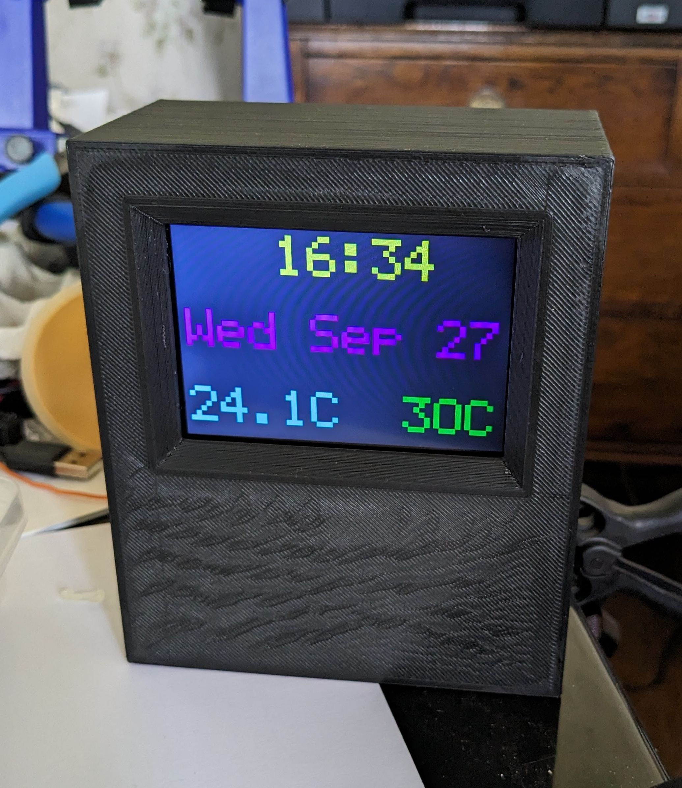
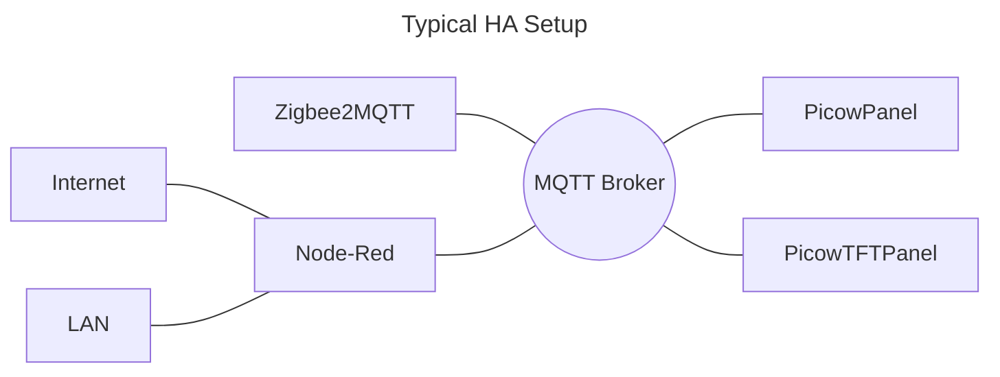
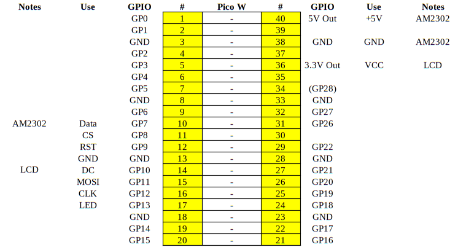

# PicowTFTPanel

An MQTT-driven Pico W-based information panel using an ILI9488 3.5" SPI TFT module (SKU MSP3521).

In addition, there is an AM2303 (DHT22) temperature and humidity sensor attached which
reports climate values via MQTT.

A desktop case design for the project (FreeCAD and .3mf files) may be found in the `3D` directory.

## Configuration

Rename the `dummy_wifi_config.h` to `wifi_config.h` and edit it to suit your WiFi setup.

* `mqtt.h` contains the high-level MQTT connection details
* `info_items.c` has the specific display items and their MQTT topics
* `lcd.h includes` the pin connections for the display
* `picowtftpanel.c` has the pin definition for the AM2302 near the top
* `image.h` includes the pixel dimensions of the panel

### Pico W Pin Allocation

 